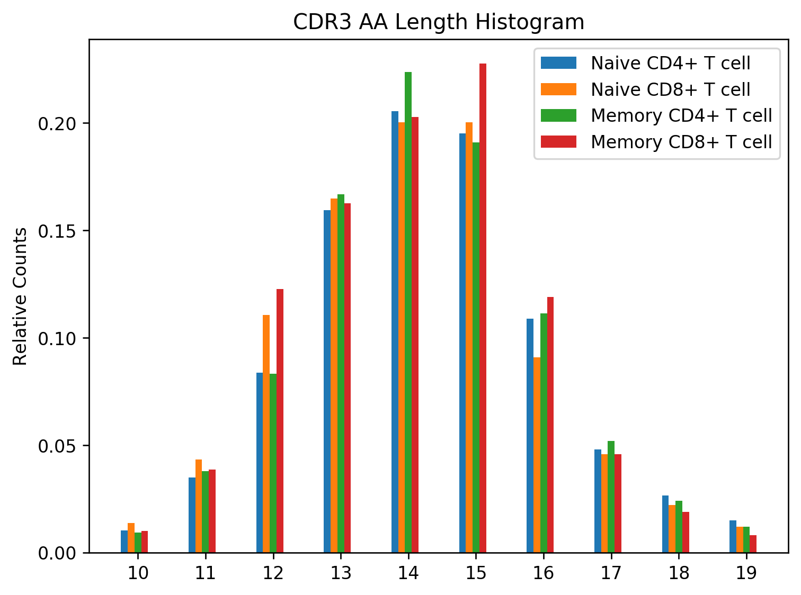

ADC API Query and Analysis Example
==================================

This example shows how repertoires and associated rearrangments may be
queried from a data repository using the ADC API and then a simple
analysis is performed. The example is split between two python
scripts; one that performs the query and saves the data into files,
and another that reads the data from the files and generates a grouped
CDR3 amino acid length distribution plot. The two scripts could be
combined into one, but this example illustrates how the data can be
saved into files for later use. The example uses the AIRR standards
python library.

Data
----

This example retrieves data for the following study, which is identified
by NCBI BioProject PRJNA300878. In this example, we are only going to
query and retrieve the T cell repertoires.

Rubelt, F. et al., 2016. Individual heritable differences result in
unique cell lymphocyte receptor repertoires of naive and
antigen-experienced cells. Nature communications, 7, p.11112.

Basic study description:

+ 5 pairs of human twins

+ B-cells and T-cells sequenced

+ B-cells sorted into naive and memory

+ T-cells sorted into naive CD4, naive CD8, memory CD4 and memory CD8

+ Total of 60 repertoires: 20 B-cell repertoires and 40 T-cell repertoires

Walkthrough
-----------

We'll use the airr-standards docker image for this example, which
comes loaded with all the python packages needed. You will want to map
a local directory inside the docker container so you can access the
data and analysis results afterwards::

    # Download the image
    docker pull airrc/airr-standards:latest

    # Make local temporary directory to hold the data
    mkdir adc_example
    cd adc_example

    # Invoke a shell session inside the docker image
    docker run -it -v $PWD:/data airrc/airr-standards:latest bash

The first python script queries the data from the VDJServer data
repository and saves them into files::

    # Query the data
    cd /data
    python3 /airr-standards/docs/examples/api/retrieve_data.py

Only a subset of the data is downloaded for illustration purposes, but
review the code to see how all data can be downloaded. A total of 40
repertoires and 300,178 rearrangements should be downloaded. The
repertoire metadata is saved in the ``repertoires.airr.json`` file,
and the rearrangements are saved in the ``rearrangements.tsv``
file. The script should take a few minutes to run and produce the
following display messages::

           Info: VDJServer Community Data Portal
        version: 1.3
    description: VDJServer ADC API response for repertoire query
    Received 40 repertoires.
    Retrieving rearrangements for repertoire: 5168912186246295065-242ac11c-0001-012
    Retrieved 9768 rearrangements for repertoire: 5168912186246295065-242ac11c-0001-012
    Retrieving rearrangements for repertoire: 5338391595746455065-242ac11c-0001-012
    Retrieved 5521 rearrangements for repertoire: 5338391595746455065-242ac11c-0001-012
    Retrieving rearrangements for repertoire: 4858300151399575065-242ac11c-0001-012
    Retrieved 2885 rearrangements for repertoire: 4858300151399575065-242ac11c-0001-012
    Retrieving rearrangements for repertoire: 5039977268020375065-242ac11c-0001-012
    Retrieved 4053 rearrangements for repertoire: 5039977268020375065-242ac11c-0001-012
    Retrieving rearrangements for repertoire: 6240077029868695065-242ac11c-0001-012
    Retrieved 3506 rearrangements for repertoire: 6240077029868695065-242ac11c-0001-012
    Retrieving rearrangements for repertoire: 6389112395039895065-242ac11c-0001-012
    Retrieved 2289 rearrangements for repertoire: 6389112395039895065-242ac11c-0001-012
    Retrieving rearrangements for repertoire: 5939858815878295065-242ac11c-0001-012
    Retrieved 3637 rearrangements for repertoire: 5939858815878295065-242ac11c-0001-012
    Retrieving rearrangements for repertoire: 6088937130722455065-242ac11c-0001-012
    Retrieved 9028 rearrangements for repertoire: 6088937130722455065-242ac11c-0001-012
    Retrieving rearrangements for repertoire: 7446748091679895065-242ac11c-0001-012
    Retrieved 1540 rearrangements for repertoire: 7446748091679895065-242ac11c-0001-012
    Retrieving rearrangements for repertoire: 7591789137265815065-242ac11c-0001-012
    Retrieved 10000 rearrangements for repertoire: 7591789137265815065-242ac11c-0001-012
    Retrieving rearrangements for repertoire: 7066128089908375065-242ac11c-0001-012
    Retrieved 5662 rearrangements for repertoire: 7066128089908375065-242ac11c-0001-012
    Retrieving rearrangements for repertoire: 5624006920930455065-242ac11c-0001-012
    Retrieved 10000 rearrangements for repertoire: 5624006920930455065-242ac11c-0001-012
    Retrieving rearrangements for repertoire: 8961797805343895065-242ac11c-0001-012
    Retrieved 1179 rearrangements for repertoire: 8961797805343895065-242ac11c-0001-012
    Retrieving rearrangements for repertoire: 9084118473933975065-242ac11c-0001-012
    Retrieved 4464 rearrangements for repertoire: 9084118473933975065-242ac11c-0001-012
    Retrieving rearrangements for repertoire: 8485700680582295065-242ac11c-0001-012
    Retrieved 3908 rearrangements for repertoire: 8485700680582295065-242ac11c-0001-012
    Retrieving rearrangements for repertoire: 7309695685264535065-242ac11c-0001-012
    Retrieved 10000 rearrangements for repertoire: 7309695685264535065-242ac11c-0001-012
    Retrieving rearrangements for repertoire: 8425807333172056551-242ac11c-0001-012
    Retrieved 6863 rearrangements for repertoire: 8425807333172056551-242ac11c-0001-012
    Retrieving rearrangements for repertoire: 8263242821018456551-242ac11c-0001-012
    Retrieved 10000 rearrangements for repertoire: 8263242821018456551-242ac11c-0001-012
    Retrieving rearrangements for repertoire: 8733756488295256551-242ac11c-0001-012
    Retrieved 5298 rearrangements for repertoire: 8733756488295256551-242ac11c-0001-012
    Retrieving rearrangements for repertoire: 8602072790999896551-242ac11c-0001-012
    Retrieved 10000 rearrangements for repertoire: 8602072790999896551-242ac11c-0001-012
    Retrieving rearrangements for repertoire: 7313153105470296551-242ac11c-0001-012
    Retrieved 9121 rearrangements for repertoire: 7313153105470296551-242ac11c-0001-012
    Retrieving rearrangements for repertoire: 6964444710708056551-242ac11c-0001-012
    Retrieved 10000 rearrangements for repertoire: 6964444710708056551-242ac11c-0001-012
    Retrieving rearrangements for repertoire: 7640859110155096551-242ac11c-0001-012
    Retrieved 10000 rearrangements for repertoire: 7640859110155096551-242ac11c-0001-012
    Retrieving rearrangements for repertoire: 7461458326201176551-242ac11c-0001-012
    Retrieved 10000 rearrangements for repertoire: 7461458326201176551-242ac11c-0001-012
    Retrieving rearrangements for repertoire: 5953881855632216551-242ac11c-0001-012
    Retrieved 5916 rearrangements for repertoire: 5953881855632216551-242ac11c-0001-012
    Retrieving rearrangements for repertoire: 7158276584776536551-242ac11c-0001-012
    Retrieved 10000 rearrangements for repertoire: 7158276584776536551-242ac11c-0001-012
    Retrieving rearrangements for repertoire: 6393557657723736551-242ac11c-0001-012
    Retrieved 7257 rearrangements for repertoire: 6393557657723736551-242ac11c-0001-012
    Retrieving rearrangements for repertoire: 6205695788196696551-242ac11c-0001-012
    Retrieved 10000 rearrangements for repertoire: 6205695788196696551-242ac11c-0001-012
    Retrieving rearrangements for repertoire: 4476756703191896551-242ac11c-0001-012
    Retrieved 10000 rearrangements for repertoire: 4476756703191896551-242ac11c-0001-012
    Retrieving rearrangements for repertoire: 4357957907784536551-242ac11c-0001-012
    Retrieved 7033 rearrangements for repertoire: 4357957907784536551-242ac11c-0001-012
    Retrieving rearrangements for repertoire: 4931851437876056551-242ac11c-0001-012
    Retrieved 10000 rearrangements for repertoire: 4931851437876056551-242ac11c-0001-012
    Retrieving rearrangements for repertoire: 4744762662462296551-242ac11c-0001-012
    Retrieved 10000 rearrangements for repertoire: 4744762662462296551-242ac11c-0001-012
    Retrieving rearrangements for repertoire: 3252733973504856551-242ac11c-0001-012
    Retrieved 10000 rearrangements for repertoire: 3252733973504856551-242ac11c-0001-012
    Retrieving rearrangements for repertoire: 2989624276951896551-242ac11c-0001-012
    Retrieved 10000 rearrangements for repertoire: 2989624276951896551-242ac11c-0001-012
    Retrieving rearrangements for repertoire: 3628844259615576551-242ac11c-0001-012
    Retrieved 5208 rearrangements for repertoire: 3628844259615576551-242ac11c-0001-012
    Retrieving rearrangements for repertoire: 3438706057421656551-242ac11c-0001-012
    Retrieved 9530 rearrangements for repertoire: 3438706057421656551-242ac11c-0001-012
    Retrieving rearrangements for repertoire: 2197374609531736551-242ac11c-0001-012
    Retrieved 10000 rearrangements for repertoire: 2197374609531736551-242ac11c-0001-012
    Retrieving rearrangements for repertoire: 1993707260355416551-242ac11c-0001-012
    Retrieved 10000 rearrangements for repertoire: 1993707260355416551-242ac11c-0001-012
    Retrieving rearrangements for repertoire: 2541616238306136551-242ac11c-0001-012
    Retrieved 6512 rearrangements for repertoire: 2541616238306136551-242ac11c-0001-012
    Retrieving rearrangements for repertoire: 2366080924918616551-242ac11c-0001-012
    Retrieved 10000 rearrangements for repertoire: 2366080924918616551-242ac11c-0001-012

The second python script loads the data from the files and generates a
CDR3 amino acid length distribution that is grouped by the T cell
subset. This study performs flow sorting to generate four T cell
subsets: naive CD4+, naive CD8+, memory CD4+, memory CD8+. The script
uses the repertoire metadata to determine the T cell subset for the
rearrangement, tabulates the counts, normalizes them, and generates a
grouped bar chart with the results::

    # Run the analysis
    python3 /airr-standards/docs/examples/api/analyze_data.py

The figure is placed in the ``plot.png`` file and should look like this:

    **CDR3 AA Length Histogram grouped by T cell subsets.**
