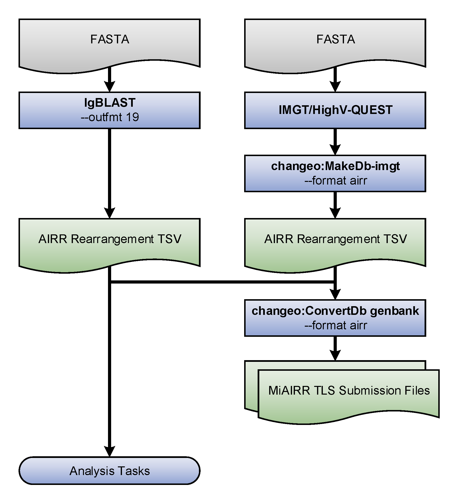
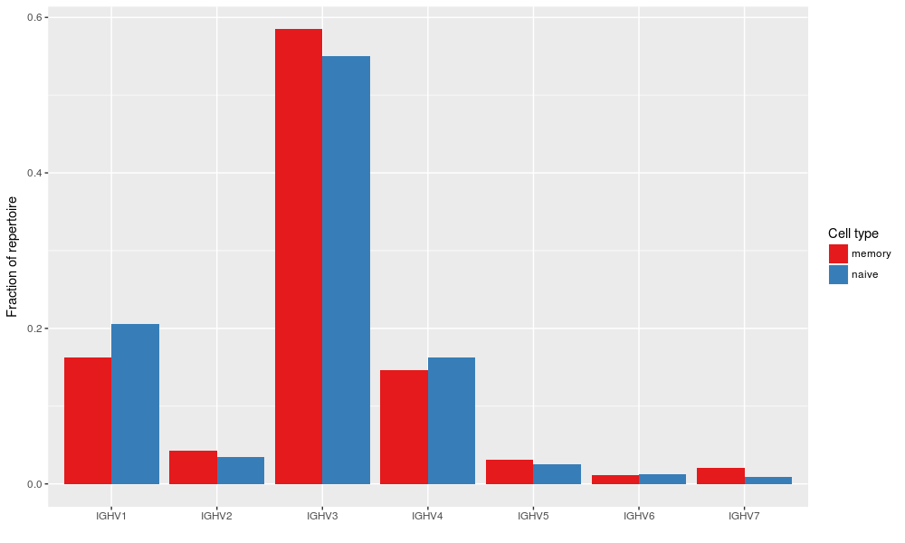

AIRR Rearrangement TSV Interoperability Example
================================================================================

The example that follows illustrates the interoperability provided by the
AIRR Rearrangement schema. The code provided demonstrates how to
take AIRR formatted data output by IgBLAST and combine it with data
processed by IMGT/HighV-QUEST that has converted to the AIRR format by
Change-O. Then, the merged output of these two distinct tools is used to
(a) create MiAIRR compliant GenBank/TLS submission files, and (b) perform
a simple V gene usage analysis task.

Data
--------------------------------------------------------------------------------

We've hosted a small set of example data from BioProject PRJNA338795
(Vander Heiden et al, 2017. J Immunol.) containing both input and output of the
example. It may be downloaded from:

`Example Data <https://clip.med.yale.edu/immcantation/examples/airr_example_data.zip>`__

Walkthrough
--------------------------------------------------------------------------------

    **Flowchart of the example steps.**

Environment setup
~~~~~~~~~~~~~~~~~~~~~~~~~~~~~~~~~~~~~~~~~~~~~~~~~~~~~~~~~~~~~~~~~~~~~~~~~~~~~~~~

We'll use the Immcantation docker image for this example, which comes loaded
with all the tools used in the steps that follow::

    # Download the image
    docker pull kleinstein/immcantation:devel

    # Invoke a shell session inside the Immcantation docker image
    # Map example data (~/data) to the container's /data directory
    $> docker run -it -v ~/data:/data:z kleinstein/immcantation:devel bash

Generate AIRR formatted TSV files
~~~~~~~~~~~~~~~~~~~~~~~~~~~~~~~~~~~~~~~~~~~~~~~~~~~~~~~~~~~~~~~~~~~~~~~~~~~~~~~~

TSV files compliant with the AIRR Rearrangement schema may be
output directly from IgBLAST v1.9+ or generated from IMGT/HighV-QUEST
output (or IgBLAST <=1.8 ouput) using the MakeDb parser provided by
Change-O::

    # Generate TSV directly with IgBLAST
    $> cd /data
    $> export IGDATA=/usr/local/share/igblast
    $> igblastn -query HD13M.fasta -out HD13M_fmt19.tsv -outfmt 19 \
          -germline_db_V $IGDATA/database/imgt_human_ig_v \
          -germline_db_D $IGDATA/database/imgt_human_ig_d \
          -germline_db_J $IGDATA/database/imgt_human_ig_j \
          -auxiliary_data $IGDATA/optional_file/human_gl.aux \
          -ig_seqtype Ig -organism human \
          -domain_system imgt

    # Generate TSV from IMGT/HighV-QUEST results using changeo:MakeDb
    $> MakeDb.py imgt -i HD13N_imgt.txz -s HD13N.fasta  \
          --scores --partial --format airr

Generate GenBank/TLS submission files
~~~~~~~~~~~~~~~~~~~~~~~~~~~~~~~~~~~~~~~~~~~~~~~~~~~~~~~~~~~~~~~~~~~~~~~~~~~~~~~~

AIRR TSV files can be input directly in Change-O's ConvertDb-genbank
tool to generate MiAIRR compliant files for submission to GenBank/TLS::

    # Generate ASN files from IgBLAST output
    $> ConvertDb.py genbank -d HD13M_fmt7_db-pass.tsv --format airr \
          --inf IgBLAST:1.7.0 --organism "Homo sapiens" \
          --tissue "Peripheral blood" --cell "naive B cell" \
          --id --asn -sbt HD13M.sbt

    # Generate ASN files from IMGT/HighV-QUEST output
    $> ConvertDb.py genbank -d HD13N_imgt_db-pass.tsv --format airr \
          --inf IMGT/HighV-QUEST:1.5.7.1 --organism "Homo sapiens" \
          --tissue "peripheral blood" --cell "naive B cell" \
          --cregion c_call --id --asn -sbt HD13M.sbt

Merge files and count V family usage
~~~~~~~~~~~~~~~~~~~~~~~~~~~~~~~~~~~~~~~~~~~~~~~~~~~~~~~~~~~~~~~~~~~~~~~~~~~~~~~~

AIRR TSV files from different tools and easy combined to perform analysis
on data generated using different software. Below is shown a simple V
family usage analysis after merging the IgBLAST and IMGT/HighV-QUEST
outputs into a single table::

    # Count V family usage in R
    # Imports
    $> R
    R> library(alakazam)
    R> library(dplyr)
    R> library(ggplot2)

    # Merge IgBLAST and IMGT/HighV-QUEST results
    R> db_m <- read.delim("HD13M_fmt7_db-pass.tsv")
    R> db_n <- read.delim("HD13N_imgt_db-pass.tsv")
    R> db_m$cell_type <- "memory"
    R> db_n$cell_type <- "naive"
    R> db <- bind_rows(db_m, db_n)

    # Subset to heavy chain
    R> db <- subset(db, grepl("IGH", v_call))

    # Count combined V gene usage
    R> v_usage <- countGenes(db, "v_call", groups="cell_type",
                             mode="family")

    # Plot V family usage
    R> ggplot(v_usage, aes(x=GENE, y=SEQ_FREQ, fill=cell_type)) +
        geom_col(position="dodge") +
        scale_fill_brewer(name="Cell type", palette="Set1") +
        xlab("") +
        ylab("Fraction of repertoire")

    **V family usage for the combined data set.**
