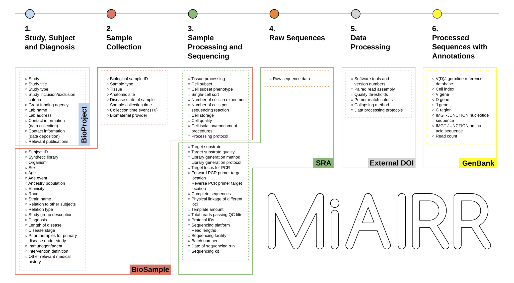

.. _MiAIRR_NCBI_Submission_Guide:

Guide for submission of AIRR-seq data to NCBI
=============================================

This site provides a detailed “how-to” guide for submission of AIRR-seq
data to **NCBI repositories** (BioProject, BioSample, SRA and GenBank).
For other implementations of the MiAIRR standard see `here`__.

.. __: https://github.com/airr-community/airr-standards

One of the primary initiatives of the AIRR (Adaptive Immune Receptor
Repertoire) Community has been to develop a set of metadata standards
for the submission of immune receptor repertoire sequencing datasets.
This work has been carried out by the AIRR Community Standards Working
Group. In order to support reproducibility, standard quality control,
and data deposition in a common repository, the AIRR Community has
agreed to six high-level data sets that will guide the publication,
curation and sharing of AIRR-Seq data and metadata: Study and subject,
sample collection, sample processing and sequencing, raw sequences,
processing of sequence data, and processed AIRR sequences. The detailed
data elements within these sets are defined :ref:`here <MiAIRR_Elements>`
(:download:`Download as TSV <../_downloads/AIRR_Minimal_Standard_Data_Elements.tsv>`).
The association between these AIRR sets, the associated data elements,
and each of the NCBI repositories is shown below:

Submission of AIRR sequencing data and metadata to NCBI's public data
repositories consists of five sequential steps:

1. Submit study information to `NCBI BioProject`_ using the NCBI web
   interface.
2. Submit sample-level information to the `NCBI BioSample repository`_
   using the `AIRR-BioSample templates`_.
3. Submit raw sequencing data to `NCBI SRA`_ using the `AIRR-SRA data
   templates`_.
4. Generate a DOI for the protocol describing how raw sequencing data
   were processed using `Zenodo`_.
5. Submit processed sequencing data with sequence-level annotations to
   `GenBank`_ using AIRR feature tags.

.. _`NCBI BioProject`: https://submit.ncbi.nlm.nih.gov/subs/bioproject/ 
.. _`NCBI BioSample repository`: https://submit.ncbi.nlm.nih.gov/subs/biosample/
.. _`AIRR-BioSample templates`: https://github.com/airr-community/airr-standards/raw/master/NCBI_implementation/templates_XLS/AIRR_BioSample_v1.0.xls
.. _`NCBI SRA`: https://submit.ncbi.nlm.nih.gov/subs/sra/
.. _`AIRR-SRA data templates`: https://github.com/airr-community/airr-standards/raw/master/NCBI_implementation/templates_XLS/AIRR_SRA_v1.0.xls
.. _`Zenodo`: https://zenodo.org
.. _`GenBank`: https://www.ncbi.nlm.nih.gov/genbank/tbl2asn2/

The :ref:`submission manual <MiAIRR_NCBI_Submission_Manual>` provides step-by-step instructions
on carrying out these steps for an AIRR study submission.

